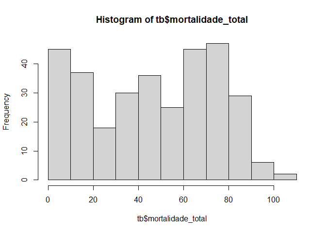
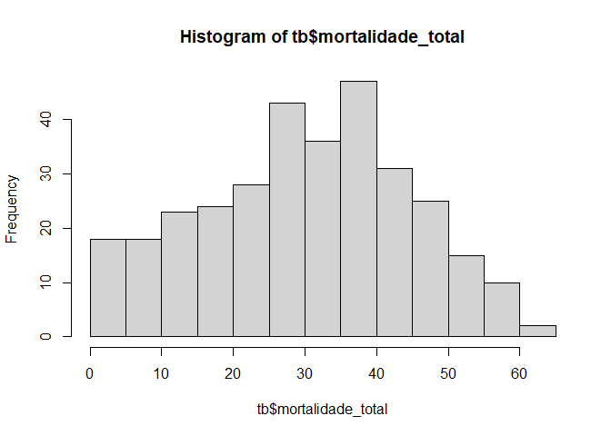
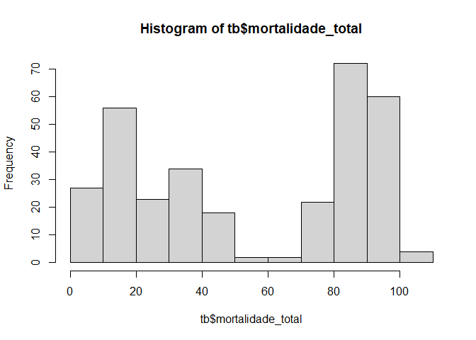
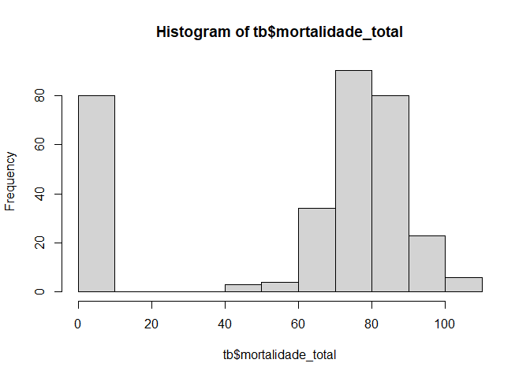

<!-- README.md is generated from README.Rmd. Please edit that file -->

# Help Ricardo Polanczyk

``` r
library(tidyverse)
library(writexl)
source("R/simulacao_plk.R")
```

### Função definida

``` r
simula_plk<-function(media, epm){
  epsilon <- 100
  gamma <- 100
  while(epsilon > 0.01 | gamma > 0.01){
    s1 <- rnorm(20,media,epm*sqrt(4))
    s2 <- rnorm(20,media,epm*sqrt(4))
    s3 <- rnorm(20,media,epm*sqrt(4))
    s4 <- rnorm(20,media,epm*sqrt(4))
    vetor <- c(s1,s2,s3,s4)
    epsilon = abs(media - mean(vetor))
    gamma = abs(epm - sd(vetor)/sqrt(4))

  }
  return(round(vetor))
}
```

## Simulação dos dados da Tabela 01


``` r
controle<-simula_plk(9.3,2.2)
lfcc_0315<-simula_plk(65.1,5.3)
lfcc_0085<-simula_plk(36.45,4.1)
lfcc_0296<-simula_plk(77.15,5.9)

mortalidade_total <- c(controle,lfcc_0315,lfcc_0085,lfcc_0296)
tratamento <- rep(c("controle","lfcc_0315","lfcc_0085","lfcc_0296"),rep(80,4))
bloco <- rep(rep(c("I","II","III","IV"),rep(20,4)),4)

tb <- tibble::tibble(tratamento, bloco, mortalidade_total) |> 
  mutate(mortalidade_total = ifelse(mortalidade_total>=0,mortalidade_total,0))
hist(tb$mortalidade_total)
```

<!-- -->

``` r
tb |>
  group_by(tratamento) |>
  summarise(media = mean(mortalidade_total),
            epm = sd(mortalidade_total)/sqrt(4))
#> # A tibble: 4 x 3
#>   tratamento media   epm
#>   <chr>      <dbl> <dbl>
#> 1 controle    9.34  2.11
#> 2 lfcc_0085  36.5   4.11
#> 3 lfcc_0296  77.2   5.90
#> 4 lfcc_0315  65.1   5.29

write_xlsx(tb,"data/Tabela01.xlsx")
```

##### **DOWNLOAD**: [Tabela01.xlsx](https://github.com/arpanosso/help_polanczyk/raw/master/data/Tabela01.xlsx)

## Simulação dos dados da Tabela 02


``` r
controle<-simula_plk(12.1,3.8)
lfcc_0315<-simula_plk(35.2,5.7)
lfcc_0085<-simula_plk(41.1,5.3)
lfcc_0296<-simula_plk(34.01,4.2)

mortalidade_total <- c(controle,lfcc_0315,lfcc_0085,lfcc_0296)
tratamento <- rep(c("controle","lfcc_0315","lfcc_0085","lfcc_0296"),rep(80,4))
bloco <- rep(rep(c("I","II","III","IV"),rep(20,4)),4)

tb <- tibble::tibble(tratamento, bloco, mortalidade_total) |> 
  mutate(mortalidade_total = ifelse(mortalidade_total>=0,mortalidade_total,0))
hist(tb$mortalidade_total)
```

<!-- -->

``` r
tb |>
  group_by(tratamento) |>
  summarise(media = mean(mortalidade_total),
            epm = sd(mortalidade_total)/sqrt(4))
#> # A tibble: 4 x 3
#>   tratamento media   epm
#>   <chr>      <dbl> <dbl>
#> 1 controle    12.2  3.78
#> 2 lfcc_0085   41.1  5.29
#> 3 lfcc_0296   34.0  4.21
#> 4 lfcc_0315   35.2  5.70

write_xlsx(tb,"data/Tabela02.xlsx")
```

##### **DOWNLOAD**: [Tabela02.xlsx](https://github.com/arpanosso/help_polanczyk/raw/master/data/Tabela02.xlsx)

## Simulação dos dados Tabela 03


``` r
controle<-simula_plk(11.4,1.2)
lfcc_0315<-simula_plk(85.5,3.9)
lfcc_0085<-simula_plk(91.10,2.8)
lfcc_0296<-simula_plk(34.9,4.2)

mortalidade_total <- c(controle,lfcc_0315,lfcc_0085,lfcc_0296)
tratamento <- rep(c("controle","lfcc_0315","lfcc_0085","lfcc_0296"),rep(80,4))
bloco <- rep(rep(c("I","II","III","IV"),rep(20,4)),4)

tb <- tibble::tibble(tratamento, bloco, mortalidade_total) |> 
    mutate(mortalidade_total = ifelse(mortalidade_total>=0,mortalidade_total,0))
hist(tb$mortalidade_total)
```

<!-- -->

``` r
tb |>
  group_by(tratamento) |>
  summarise(media = mean(mortalidade_total),
            epm = sd(mortalidade_total)/sqrt(4))
#> # A tibble: 4 x 3
#>   tratamento media   epm
#>   <chr>      <dbl> <dbl>
#> 1 controle    11.4  1.20
#> 2 lfcc_0085   91.1  2.83
#> 3 lfcc_0296   34.9  4.22
#> 4 lfcc_0315   85.5  3.89

write_xlsx(tb,"data/Tabela03.xlsx")
```

##### **DOWNLOAD**: [Tabela03.xlsx](https://github.com/arpanosso/help_polanczyk/raw/master/data/Tabela03.xlsx)

## Simulação dos dados da Tabela 04


``` r
controle<-simula_plk(5.4,.5)
lfcc_0315<-simula_plk(80.7,4.1)
lfcc_0085<-simula_plk(76.9,6.7)
lfcc_0296<-simula_plk(80.0,3.9)

mortalidade_total <- c(controle,lfcc_0315,lfcc_0085,lfcc_0296)
tratamento <- rep(c("controle","lfcc_0315","lfcc_0085","lfcc_0296"),rep(80,4))
bloco <- rep(rep(c("I","II","III","IV"),rep(20,4)),4)

tb <- tibble::tibble(tratamento, bloco, mortalidade_total) |> 
    mutate(mortalidade_total = ifelse(mortalidade_total>=0,mortalidade_total,0))
hist(tb$mortalidade_total)
```

<!-- -->

``` r
tb |>
  group_by(tratamento) |>
  summarise(media = mean(mortalidade_total),
            epm = sd(mortalidade_total)/sqrt(4))
#> # A tibble: 4 x 3
#>   tratamento media   epm
#>   <chr>      <dbl> <dbl>
#> 1 controle     5.4 0.488
#> 2 lfcc_0085   76.9 6.67 
#> 3 lfcc_0296   80.0 3.91 
#> 4 lfcc_0315   80.7 4.12

write_xlsx(tb,"data/Tabela04.xlsx")
```

##### **DOWNLOAD**: [Tabela04.xlsx](https://github.com/arpanosso/help_polanczyk/raw/master/data/Tabela04.xlsx)
